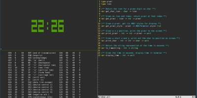

# OPomodoro
A simple Pomodoro timer in OCaml.



### Installation via opam
```bash
opam install opomodoro
```

### Usage:
Launch with: `opomodoro`

`space`: pause/un-pause\
`r`: reset\
`b`: begin break\
`ctrl-c`: exit

### Development
#### Running:
`dune exec ./opomodoro.exe`

#### Compiling:
`dune build @default`

### Notes:
Currently the countdown is off by a second or two,\
because the method used to generate clock ticks is not ideal.
